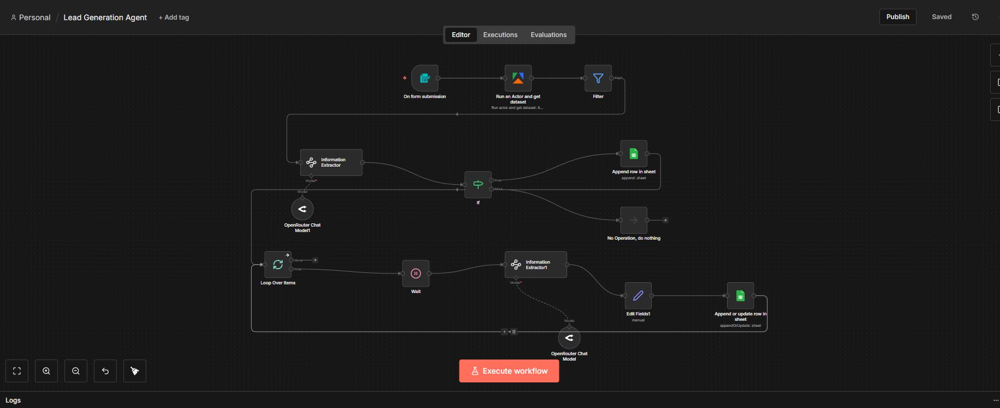

# 🔎 AI Lead Generation & Outreach Agent

> A fully automated AI-powered lead generation system that scrapes leads, qualifies them intelligently, and sends personalized outreach messages at scale.

---

## 🚀 Overview

This project is an end-to-end AI automation workflow designed to:

• Scrape business leads from Google Maps  
• Extract and filter high-quality prospects  
• Generate personalized outreach messages  
• Store and manage leads dynamically  
• Automate scalable outreach preparation  

The system eliminates manual prospecting and replaces it with intelligent automation.

---

## 🧠 What This System Does

### 1️⃣ Lead Scraping
- Automatically scrapes business data from Google Maps
- Collects name, website, contact info, and metadata
- Structures raw lead data into usable format

### 2️⃣ Intelligent Lead Qualification
- Filters relevant businesses
- Removes duplicates
- Identifies decision-maker context
- Selects only high-potential prospects

### 3️⃣ AI Personalization Engine
- Analyzes each business
- Generates custom outreach messages
- Avoids generic templates
- Creates human-like messaging

### 4️⃣ Automated Data Management
- Appends leads into Google Sheets
- Updates existing records
- Prevents duplicate entries
- Maintains structured database

---

## 🏗️ System Architecture

Form Trigger  
→ Google Maps Scraper (Actor)  
→ Data Filtering  
→ Information Extraction  
→ AI Personalization (LLM)  
→ Lead Storage (Google Sheets)  
→ Outreach Preparation  

---

## 🛠️ Tech Stack

- Workflow Automation Platform  
- Google Maps Scraping Actor  
- OpenRouter / LLM Integration  
- Google Sheets API  
- Conditional Logic & Looping  
- Data Extraction Modules  

---

## 📸 Workflow Preview

---

## 💡 Why This Project Matters

Manual lead generation is:

- Slow  
- Repetitive  
- Non-scalable  
- Generic  

This system turns prospecting into:

✔ Intelligent  
✔ Scalable  
✔ Personalized  
✔ Automated  

---

## 🎯 Use Cases

- Marketing Agencies  
- Real Estate Agencies  
- SaaS Founders  
- Local Service Businesses  
- B2B Outreach Teams  

---

## 📈 Business Impact

- Reduces manual research time  
- Increases response rate through personalization  
- Enables scalable outbound campaigns  
- Maintains structured lead database  

---

## 🔥 Key Differentiator

This is NOT a simple scraper.

It combines:

Scraping + AI Qualification + AI Personalization + Data Automation

Into one intelligent workflow.

---

## 👨‍💻 Built By

Niaz Morshed  
AI Automation Developer  

GitHub: https://github.com/hello-niaz  
LinkedIn: https://www.linkedin.com/in/niaz-morshed-/
